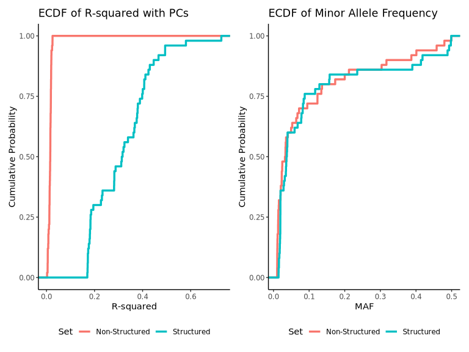
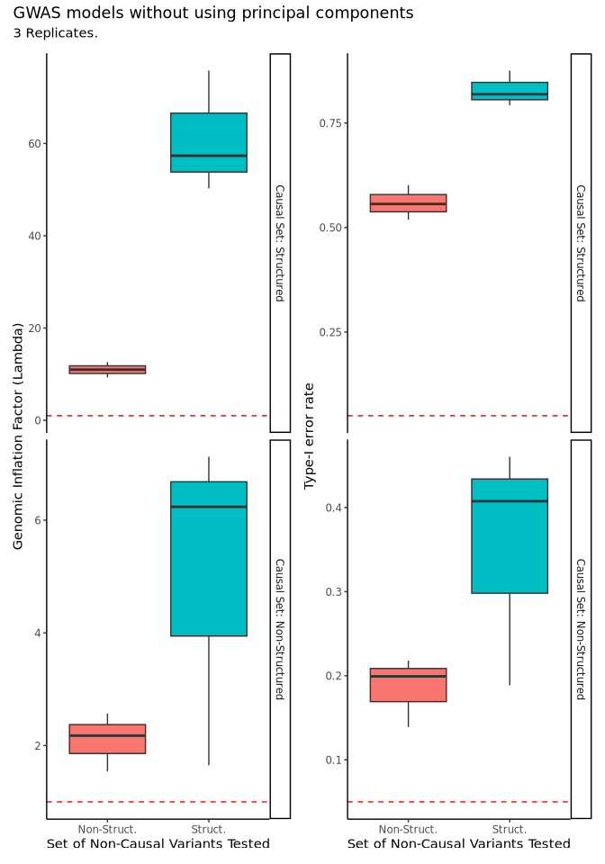
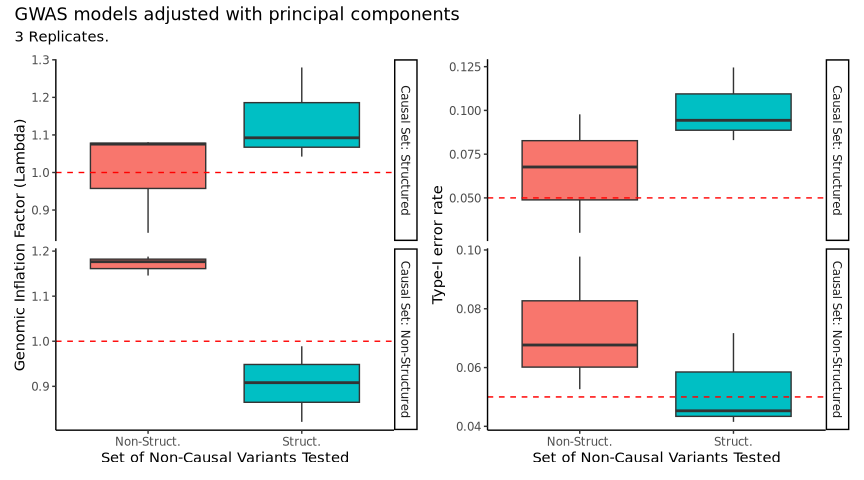

# phenocause: a package for simulating complex phenotypes
  
A central challenge in genetic epidemiology is to disentangle the
genetic basis of a complex trait from the effects of environmental and
social factors, especially when those factors are correlated with
genetic ancestry or the true polygenic score. `phenocause` is a
simulation toolkit designed to address this problem by allowing
researchers to simulate phenotypes where the contributions of genetics,
population structure, and different types of confounding can be
explicitly and precisely controlled. The package implements a two-step
workflow: first, sampling a set of causal variants to define a trait’s
genetic architecture, and second, simulating a final phenotype based on
those variants under a variety of user-specified confounding models.
This package includes example genotype data and metadata to allow users
to follow the tutorial.
  
## motivation and a note on confounding
  
The development of `phenocause` was driven by a specific theoretical
motivation regarding the nature of confounding in genetic studies. This
framework relies on a critical distinction between two types of genetic
relationship matrices (GRMs): “shallow GRMs”, which are designed to
quantify only recent relatedness (e.g., kinship coefficients from
IBD-based methods), and “deep GRMs”, which are derived from coalescent
theory and aim to capture the full, complete genetic covariance
resulting from both recent and distant shared ancestry.
  
The central hypothesis motivating this package is that when a mixed
model includes a well-specified “deep GRM”, it fully accounts for the
genetic covariance structure among all individuals. Consequently, any
remaining inflation in test statistics must be due to external factors,
such as environmental confounding correlated with ancestry, rather than
residual “genetic confounding”.
  
Under this framework, principal components (PCs) become irrelevant for
controlling *genetic* effects, and their utility is restricted to
serving as proxies for these unmodeled environmental confounders.
`phenocause` was therefore developed as a companion toolkit to generate
the precise data structures needed to benchmark analytical methods and
test this hypothesis empirically.
  
## the simulation framework: theoretical models
  
`phenocause` generates phenotypes using an additive model. All
confounding effects are optional and are added to a base genetic model.
The quantitative liability for a trait (*Y*) is simulated as the sum of
a genetic component (*g*), one or more optional confounding effects
(*P**k*), and a random residual error (*E*).
  
The general model is:
  
*Y* = *μ* + *g* + *P**c**c* + *P**g**c* + *P**a**c* + *E*
  
Where:
  
- ***Y*** is the final quantitative phenotype, which is treated as an
  unobserved liability for binary (case/control) traits.
- ***μ*** is the baseline mean of the phenotype.
- ***g*** is the individual’s true total genetic effect, or polygenic
  score, determined by their causal alleles.
- ***P**c**c*** is the additive effect from a **c**ategorical
  **c**onfounder (e.g., socioeconomic status).
- ***P**g**c*** is the additive effect from a quantitative
  confounder correlated with the **g**enetic component *g*.
- ***P**a**c*** is the additive effect from a quantitative
  confounder correlated with a specific **a**ncestry **c**omponent *Q*.
- ***E*** is a normally-distributed residual error term, the variance of
  which is scaled to meet the target heritability.
  
### the genetic component (*g*)
  
The total genetic effect for an individual *i* is the sum of their
dosages at *M* causal variants, weighted by each variant’s effect size,
*β**j*:
  

  
  
  
The effect sizes are drawn from a normal distribution whose variance is
dependent on the allele frequency *p**j* of the variant,
controlled by the parameter *α*. This model is adopted from the LDAK
software.
  
*β**j* ∼ 𝒩(0, 

  
*α*)
  
The *α* parameter models the relationship between allele frequency and
the variance explained by a variant. A value of *α* = −1, the default,
corresponds to the standard GCTA model where all variants are assumed to
contribute equally to heritability, regardless of their frequency. Other
values can be used to model architectures where, for example,
low-frequency variants have larger effects.
  
### the confounding components (*P*)
  
`phenocause` can simulate three distinct types of confounding.
  
#### categorical confounder (*P**c**c*)
  
This models an observable categorical variable, *X**c**c*,
that influences the phenotype. The total effect is
*P**c**c* = *X**c**c**β**c**c*. The
simulation distinguishes between two scales:
  
- **Nominal Scale**: When the input is a `character` vector (e.g.,
  country of birth, population label), each category is assigned an
  independent, random effect.
  
- **Ordinal Scale**: When the input is an ordered `factor` (e.g.,
  educational attainment levels), the effects are simulated to be
  monotonically increasing across the factor levels.
  
The total variance explained by this component is controlled by the
`categorical_confounder_variance` parameter.
  
#### quantitative confounders (*P**g**c* and *P**a**c*)
  
The package can simulate two types of quantitative confounders that
represent distinct causal scenarios. The distinction between these
models is critical for designing simulation studies to test different
hypotheses.
  
The **ancestry-correlated confounder (*P**a**c*)** is
designed to simulate classic confounding by population structure, where
an external socio-environmental factor (*X**a**c*) is
correlated with an ancestry component (*Q*). It helps answer questions
about the robustness of GWAS methods to this common source of bias. The
simulation is governed by four parameters:
  
- `ancestry_component` (*Q*): The vector of ancestry values for each
  individual.  
- `ancestry_confounder_coeff` (*γ**a**c*): The direct effect
  of the confounder, where
  *P**a**c* = *X**a**c**γ**a**c*.  
- `ancestry_confounder_cor` (*ρ**a**c*): The target
  correlation between the ancestry component and the confounder,
  *C**o**r*(*Q*, *X**a**c*).  
- `ancestry_confounder_rel_var` (*w**a**c*): The target
  variance of the confounding effect relative to the genetic variance,
  *V**a**r*(*P**a**c*)/*V**a**r*(*g*).
  
In contrast, the **genetically-correlated confounder
(*P**g**c*)** is designed to simulate confounding from
pleiotropy or a gene-environment correlation pathway, where a latent
quantitative confounder (*X**g**c*) is correlated with the
true polygenic score (*g*) itself. It helps answer different questions,
such as whether an association signal is driven by a direct genetic
effect or an indirect one mediated by another genetically-influenced
trait. The simulation is governed by three analogous parameters:
  
- `genetic_confounder_coeff` (*γ**g**c*): The direct linear
  effect of the confounder on the phenotype, where
  *P**g**c* = *X**g**c**γ**g**c*.  
- `genetic_confounder_cor` (*ρ**g**c*): The target
  correlation between the genetic effect and the confounder,
  *C**o**r*(*g*, *X**g**c*).  
- `genetic_confounder_rel_var` (*w**g**c*): The target
  variance of the confounding effect *relative to* the genetic variance,
  *V**a**r*(*P**g**c*)/*V**a**r*(*g*).
  
### simulating binary traits
  
For binary (case/control) outcomes, the quantitative trait *Y* is
treated as an unobserved liability. A threshold is applied to this
liability distribution, and individuals with a liability exceeding the
threshold are assigned “case” status. The threshold value is determined
by the user-specified `prevalence` of the trait.
  
## installation
  
You can install `phenocause` from GitHub using the `devtools` package.
  
    if (!requireNamespace("devtools", quietly = TRUE)) {
      install.packages("devtools")
    }
    devtools::install_github("diegovelizo/phenocause")
  
## the two-step simulation workflow
  
Below we demonstrate how to use `phenocause` to simulate phenotype data.
The pipeline consists of two main steps: first, running one of the
`sample_causal_sites.*()` functions to sample causal sites from genotype
data in the GDS (Genomic Data Structure) format (see “[working with the
genomic data structure (gds)
format](#working-with-the-genomic-data-structure-gds-format)”), and then
passing the resulting genotypes to the `simulate_phenotype()` function.
  
You can skip the explanations and proceed directly to the [step-by-step
tutorial](#step-by-step-tutorial).
  
## working with the genomic data structure (gds) format
  
### why gds?
  
The package is designed to operate on genotype data stored in GDS
files.  
GDS files store the same information as a VCF file; however, the GDS
format is optimized for high-performance computation and efficient
access.  
Its primary advantages are:
  
- **Efficiency:** Data is stored in on-disk chunks, allowing for much
  faster access to specific variants or samples compared to parsing a
  text-based VCF file.
  
- **Memory Management:** The entire dataset does not need to be loaded
  into memory.  
  Instead, a connection is opened to the file on disk, and only the
  requested data slices are read.
  
- **On-Disk Filtering:** Filters (e.g., by minor allele count,
  missingness or sample ID) can be applied to the file connection
  itself, before loading the data, ensuring that subsequent operations
  only process the subset of data that meets the specified criteria.
  
### obtaining gds files
  
This package includes example GDS files that can be used to follow the
tutorial.  
The paths on your system can be retrieved with the following command:
  
    gds_paths <- system.file(
      paste0("extdata/example.chr", 1:3, ".gds"), package = "phenocause"
    )
  
To use your own data, you must first convert it from VCF format to GDS
using the `seqVCF2GDS()` function from the `SeqArray` package.
  
    # Define path to an existing VCF file and the desired output path for the GDS file
    vcf_path <- "/path/to/your/data.vcf.gz" 
    gds_path <- "/path/to/your/output.gds" 
  
    # Convert the VCF to GDS. GT (genotype) is the minimum required format.
    SeqArray::seqVCF2GDS(vcf_path, gds_path, fmt.import="GT", storage.option="LZMA_RA", parallel = 4)
  
### gds access demonstration (optional)
  
Once you have a GDS file, you can open a connection and perform various
high-performance operations.  
Note: This is just a demonstration of how GDS files can be efficiently
accessed.  
These operations are done under the hood by `phenocause`, so you don’t
need to deal with them.
  
    # Use the first example GDS file
    gds_path <- gds_paths[1] 
  
    # 1. Open a connection to the GDS file (does not load data into memory)
    gds <- SeqArray::seqOpen(gds_path)
  
    # 2. Get basic information
    sample_ids <- SeqArray::seqGetData(gds, "sample.id")
    variant_ids <- SeqArray::seqGetData(gds, "variant.id") # These are internal indices
    cat("First 6 sample IDs:", head(sample_ids), "\n")
    #> First 6 sample IDs: tsk.1 tsk.2 tsk.3 tsk.4 tsk.5 tsk.6
  
    # 3. Apply filters without loading data
    # Get per-variant statistics
    mac <- SeqArray::seqAlleleCount(gds, minor = TRUE)
    missingness <- SeqArray::seqMissing(gds, per.variant = TRUE)
  
    # Create boolean vectors for filtering
    mac_filter <- mac >= 20
    missingness_filter <- missingness <= 0.02
    final_filter <- mac_filter & missingness_filter
  
    # Apply the filter to the GDS connection. 
    # Subsequent operations will only use variants that pass this filter.
    SeqArray::seqSetFilter(gds, variant.sel = final_filter)
    #> # of selected variants: 6,559
  
    # 4. Access data only from the filtered sites
    # Get annotations for the filtered variants
    sites_annotation <-  data.frame(
        chr = SeqArray::seqGetData(gds, "chromosome"),
        pos = SeqArray::seqGetData(gds, "position"),
        rsid = SeqArray::seqGetData(gds, "annotation/id")
    )
    cat("\nAnnotations for the first 6 variants passing filters:\n")
    #> 
    #> Annotations for the first 6 variants passing filters:
    print(head(sites_annotation))
    #>   chr  pos rsid
    #> 1   1 1400   20
    #> 2   1 2337   40
    #> 3   1 3028   58
    #> 4   1 4259   88
    #> 5   1 4432   90
    #> 6   1 6100  128
  
    # Get genotype dosages for the filtered variants
    # The altDosage function returns a matrix of samples x variants
    genotype_data <- SeqVarTools::altDosage(gdsobj = gds, use.names = TRUE, parallel = 2)
    cat("\nDimensions of genotype matrix from filtered sites (samples x variants):\n")
    #> 
    #> Dimensions of genotype matrix from filtered sites (samples x variants):
    print(dim(genotype_data))
    #> [1] 5000 6559
  
    # 5. Close the GDS file connection
    SeqArray::seqClose(gds)
  
## data included with `phenocause`
  
The package includes three data objects to support the tutorial.  
They can be loaded with `data()`.
  
### genetic data
  
The example GDS files contain genotypes for 5,000 individuals across
portions of chromosomes 20, 21, and 22.  
The data was simulated using `msprime` with a demographic model of Latin
American and reference continental populations resembling the 1000
Genomes Project populations, to provide a realistic background of
population structure and admixture.
  
### metadata (`phenocause.metadata`)
  
This data frame contains sample-level information for the 5,000
simulated individuals, including population labels and the first 20
principal components calculated from the genetic data.
  
    data(phenocause.metadata)
    cat("Metadata for the first 6 samples:\n")
    #> Metadata for the first 6 samples:
    print(head(phenocause.metadata[, 1:8]))
    #>    sample.id population         PC1         PC2         PC3          PC4
    #>       <char>     <char>       <num>       <num>       <num>        <num>
    #> 1:     tsk.1        PEL -0.00773583 -0.00267714 -0.00841580 -1.44793e-02
    #> 2:     tsk.2        PEL -0.00863668 -0.00816183 -0.00813049 -6.31525e-03
    #> 3:     tsk.3        PEL -0.00862303 -0.00937326 -0.00993566  3.54648e-02
    #> 4:     tsk.4        PEL -0.00817220 -0.00699110 -0.00997924  3.06836e-02
    #> 5:     tsk.5        PEL -0.00960193 -0.01718230 -0.01265610  5.95974e-05
    #> 6:     tsk.6        PEL -0.00630836 -0.01232940 -0.01014900 -1.62568e-02
    #>            PC5         PC6
    #>          <num>       <num>
    #> 1:  0.04927020  0.01048540
    #> 2: -0.03133970 -0.00317630
    #> 3: -0.00470034 -0.00986719
    #> 4: -0.01424360 -0.00314133
    #> 5: -0.00729436  0.00823931
    #> 6: -0.02224340  0.00748102
  
### ldak weights (`phenocause.ldak_weights`)
  
This is a list of data frames containing pre-computed Linkage
Disequilibrium (LD) weights from the LDAK software.  
Each data frame corresponds to a chromosome in the example dataset.  
These weights measure the extent of local LD surrounding each variant
and can be used to simulate genetic architectures where causal variant
probability is related to LD patterns.
  
    data(phenocause.ldak_weights)
    cat("LDAK weights for the first 6 variants on chromosome 1:\n")
    #> LDAK weights for the first 6 variants on chromosome 1:
    # The data object is a list named by chromosome
    print(head(phenocause.ldak_weights[["chr1"]]))
    #>     rsid   weight
    #>    <int>    <num>
    #> 1:    20 0.888681
    #> 2:    40 0.702670
    #> 3:    58 0.838932
    #> 4:    88 0.809851
    #> 5:    90 0.632627
    #> 6:   128 0.587576
  
## step-by-step tutorial
  
This tutorial demonstrates the two-step workflow for simulating
phenotypes with `phenocause`.  
First, we select causal variants to define the genetic architecture.  
Second, we use those variants to simulate a phenotype with specified
genetic and confounding effects.
  
Before starting, we load the required libraries and get the paths to the
example GDS files included with the package.
  
    # phenocause and data manipulation
    library(phenocause)
    library(dplyr)
    library(glue)
    library(data.table)
  
    # Plotting
    library(ggplot2)
    library(patchwork)
  
    # GDS and GWAS
    library(SeqArray)
    library(SeqVarTools)
    library(GENESIS)
    library(Biobase)
  
    gds_paths <- system.file(
      paste0("extdata/example.chr", 1:3, ".gds"), package = "phenocause"
    )
  
### part 1: defining the genetic architecture
  
The first step is to define the degree of polygenicity and how the
causal sites are distributed along the genome.  
For instance, we can sample causal sites with uniform probability,
oversample them in high- or low-LD regions, or enrich them based on any
user-defined genomic feature.  
The package provides several wrapper functions,
`sample_causal_sites.*()`, for these different modes.
  
#### example 1.1: uniform sampling (basic model)
  
The simplest model of genetic architecture is one where every variant
has an equal *a priori* probability of being causal.  
This is achieved by sampling with uniform probability using the
`sample_causal_sites.uniform()` function.  
We will sample 1,000 sites and use this set for the phenotype simulation
examples in Part 2.
  
    set.seed(123)
    n_causal_sites <- 1000 
  
    uniform_sites <- phenocause::sample_causal_sites.uniform(
      gds_paths = gds_paths,
      n_causal_sites = n_causal_sites,
      n_threads = 2
    )
    #> # of selected variants: 6,559
    #> # of selected variants: 3,851
    #> # of selected variants: 4,208
    #> # of selected variants: 449
    #> # of selected variants: 263
    #> # of selected variants: 288
  
    # The output is a list containing two data frames. We will use 'causal_genotypes'
    # as the primary input for the phenotype simulation function.
    causal_geno_df <- uniform_sitescausal_genotypes), "\n")
    #> Number of sites sampled with LDAK weights: 500
  
#### example 1.3: weighted sampling (custom weights)
  
The `sample_causal_sites.custom()` mode offers maximum flexibility,
allowing a researcher to test hypotheses about any user-defined genomic
feature.  
For example, one could use weights based on functional annotation scores
(e.g., CADD, PhyloP) to simulate a trait where causal variants are
enriched in functionally important regions of the genome.  
The input file must contain `chr`, `pos`, and `weight` columns.
  
    # Create temporary custom weight files with random weights for demonstration
    tmp_custom_files <- sapply(1:3, function(chr_idx) {
      tmp_file <- tempfile(fileext = ".tsv")
      gds <- SeqArray::seqOpen(gds_paths[chr_idx])
      on.exit(SeqArray::seqClose(gds))
  
      annot_df <- data.frame(
          chr = SeqArray::seqGetData(gds, "chromosome"),
          pos = SeqArray::seqGetData(gds, "position"),
          rsid = SeqArray::seqGetData(gds, "annotation/id"),
          ref = SeqArray::seqGetData(gds, "alt")
      )
      # For this example, we assign random weights
      annot_dfcausal_genotypes), "\n")
    #> Number of sites sampled with custom weights: 500
    file.remove(tmp_custom_files)
    #> [1] TRUE TRUE TRUE
  
#### example 1.4: collider sampling (visual check)
  
To study collider bias, we need to generate sets of variants that are
matched on allele frequency but differ in their correlation with
population structure (as measured by PCs).  
The `sample_causal_sites.collider()` function does this by partitioning
variants based on their squared multiple correlation (*R*2)
with a given set of PCs.  
It returns a “structured” set (high *R*2) and a
“non-structured” set (low *R*2).  
We can visually confirm that the function works as intended by plotting
the empirical cumulative distribution functions (ECDFs) of MAF and
*R*2 for both sets.
  
    # Load metadata to get the PC matrix
    data(phenocause.metadata)
    pca_matrix <- phenocause.metadata[, c("sample.id", paste0("PC", 1:10))]
  
    # Run collider sampling
    collider_sites <- phenocause::sample_causal_sites.collider(
      gds_paths = gds_paths,
      n_causal_sites = 50,
      pca_matrix = pca_matrix,
      n_threads = 2
    )
    #> # of selected samples: 5,000
    #> # of selected variants: 6,559
    #> # of selected samples: 5,000
    #> # of selected variants: 3,851
    #> # of selected samples: 5,000
    #> # of selected variants: 4,208
    #> >>> Prefiltering finished. Regressing genotypes on principal components using 2 threads... 
    #> >>> Processing file with chromosome(s) 1. 
    #> >> Number of variants to be regressed: 6559. 
    #> # of selected samples: 5,000
    #> # of selected variants: 6,559
    #> >>> Processing file with chromosome(s) 2. 
    #> >> Number of variants to be regressed: 3851. 
    #> # of selected samples: 5,000
    #> # of selected variants: 3,851
    #> >>> Processing file with chromosome(s) 3. 
    #> >> Number of variants to be regressed: 4208. 
    #> # of selected samples: 5,000
    #> # of selected variants: 4,208
    #> >>> Finished regressing genotypes on principal components.
    #> # of selected variants: 706
    #> # of selected variants: 531
    #> # of selected variants: 564
    #> # of selected samples: 5,000
    #> # of selected variants: 25
    #> # of selected samples: 5,000
    #> # of selected variants: 9
    #> # of selected samples: 5,000
    #> # of selected variants: 16
    #> # of selected samples: 5,000
    #> # of selected variants: 22
    #> # of selected samples: 5,000
    #> # of selected variants: 9
    #> # of selected samples: 5,000
    #> # of selected variants: 19
  
    # Combine annotations for plotting
    structured_df <- collider_sitescausal_structured %>% dplyr::mutate(Set = "Structured")
    non_structured_df <- collider_sitescausal_non_structured %>% dplyr::mutate(Set = "Non-Structured")
    plot_df <- dplyr::bind_rows(structured_df, non_structured_df)
  
    # Plot ECDF of R^2
    p_r2 <- ggplot2::ggplot(plot_df, ggplot2::aes(x = r2, color = Set)) +
      ggplot2::stat_ecdf(geom = "step", size = 1.2) +
      ggplot2::labs(
        title = "ECDF of R-squared with PCs",
        x = "R-squared", y = "Cumulative Probability"
      ) +
      ggplot2::theme_classic() +
      ggplot2::theme(legend.position = "bottom")
  
    # Plot ECDF of MAF
    p_maf <- ggplot2::ggplot(plot_df, ggplot2::aes(x = maf, color = Set)) +
      ggplot2::stat_ecdf(geom = "step", size = 1.2) +
      ggplot2::labs(
        title = "ECDF of Minor Allele Frequency",
        x = "MAF", y = "Cumulative Probability"
      ) +
      ggplot2::theme_classic() +
      ggplot2::theme(legend.position = "bottom")
  
    # Show plots side-by-side
    print(p_r2 | p_maf)
  

  
The plots confirm that the two sets have highly distinct distributions
of *R*2 values, while their MAF distributions are nearly
identical, just as required.
  
------------------------------------------------------------------------
  
### part 2: specifying the phenotype’s causal components
  
Once a set of causal genotypes has been sampled, the
`simulate_phenotype()` function uses them to construct the final
phenotype.  
This function operationalizes the theoretical models described earlier,
allowing for the precise addition of genetic and confounding effects.
  
#### example 2.1: basic quantitative trait
  
The most fundamental simulation is of a trait with only a genetic
component (*g*) and a residual error component (*E*).  
It is critical to note that even though the population is genetically
structured, we are not simulating any *environmental* factor correlated
with that structure.  
Therefore, as outlined in the motivation, the phenotypic covariance in
this scenario can be fully modeled by a “deep GRM”, and a mixed linear
model including such a GRM but without PCs should be sufficient to
control for test statistic inflation.
  
    target_h2 <- 0.6
  
    sim_basic <- phenocause::simulate_phenotype(
      causal_genotypes = causal_geno_df,
      heritability = target_h2
    )
  
    # Validation: Check if the observed heritability is close to the target
    observed_h2 <- stats::var(sim_basicg) / stats::var(sim_basicy_quantitative)
    cat(sprintf("Target h2: %.3f | Observed h2: %.3f\n", target_h2, observed_h2))
    #> Target h2: 0.600 | Observed h2: 0.596
  
    # Clarify function output structure
    cat("\nStructure of the returned list:\n")
    #> 
    #> Structure of the returned list:
    print(utils::str(sim_basic, max.level = 1))
    #> List of 3
    #>   confounders :'data.frame':    5000 obs. of  1 variable:
    #>  phenotypes))
    #>   sample.id          g p_categorical_confounder p_genetic_confounder
    #> 1     tsk.1 -55.762862                       NA                   NA
    #> 2     tsk.2 -11.737977                       NA                   NA
    #> 3     tsk.3  -4.087274                       NA                   NA
    #> 4     tsk.4  44.009930                       NA                   NA
    #> 5     tsk.5 -14.762073                       NA                   NA
    #> 6     tsk.6 -28.209572                       NA                   NA
    #>   p_ancestry_confounder   residual y_quantitative
    #> 1                    NA   5.961836      -49.80103
    #> 2                    NA   1.358351      -10.37963
    #> 3                    NA -26.492897      -30.58017
    #> 4                    NA  -6.378849       37.63108
    #> 5                    NA  -4.529868      -19.29194
    #> 6                    NA  -8.933301      -37.14287
  
#### example 2.2: adding a categorical confounder (ordinal scale)
  
We can incorporate a categorical confounder on either a nominal or
ordinal scale.  
The scale is determined by the class of the input vector: a `character`
class is treated as nominal, while a `factor` is treated as ordinal,
with effects that increase monotonically across the defined levels.  
This is useful for simulating variables like socioeconomic status.  
In this example, we create an ordinal confounder from the population
labels by ordering them based on their mean value along PC1.
  
    # Create an ordered factor where levels are sorted by their average PC1 value
    data(phenocause.metadata)
    confounder_levels <- phenocause.metadata %>%
      dplyr::group_by(population) %>%
      dplyr::summarise(mean_pc1 = mean(PC1)) %>%
      dplyr::arrange(mean_pc1) %>%
      dplyr::pull(population)
  
    categorical_confounder <- factor(phenocause.metadataphenotypesPC1
  
    # Define simulation parameters
    target_anc_cor <- 0.8 
    target_anc_rel_var <- 0.15 
  
    sim_anc_conf <- phenocause::simulate_phenotype(
      causal_genotypes = causal_geno_df,
      heritability = 0.5,
      ancestry_component = pc1,
      ancestry_confounder_coeff = 0.6,
      ancestry_confounder_cor = target_anc_cor,
      ancestry_confounder_rel_var = target_anc_rel_var
    )
  
    # Validation
    g_anc <- sim_anc_confg
    p_ancestry <- sim_anc_confp_ancestry_confounder
    x_ancestry <- sim_anc_confX_ancestry_confounder
    observed_anc_cor <- stats::cor(pc1, x_ancestry)
    observed_anc_rel_var <- stats::var(p_ancestry) / stats::var(g_anc)
    cat(sprintf("Target Cor(Q, X_ac): %.3f | Observed: %.3f\n", target_anc_cor, observed_anc_cor))
    #> Target Cor(Q, X_ac): 0.800 | Observed: 0.799
    cat(sprintf("Target Var(P_ac)/Var(g): %.3f | Observed: %.3f\n", target_anc_rel_var, observed_anc_rel_var))
    #> Target Var(P_ac)/Var(g): 0.150 | Observed: 0.147
  
#### example 2.4: adding a confounder correlated with the polygenic score
  
This models a distinct form of confounding, such as pleiotropy, where
the confounding variable is correlated with an individual’s true
polygenic score (*g*) itself.
  
    set.seed(456)
    target_g_cor <- 0.7 
    target_g_rel_var <- 0.2
  
    sim_genetic_conf <- phenocause::simulate_phenotype(
      causal_genotypes = causal_geno_df,
      heritability = 0.5,
      genetic_confounder_coeff = 0.5,
      genetic_confounder_cor = target_g_cor,
      genetic_confounder_rel_var = target_g_rel_var
    )
  
    # Validation
    g <- sim_genetic_confg
    p_genetic <- sim_genetic_confp_genetic_confounder
    x_genetic <- sim_genetic_confX_genetic_confounder
    observed_g_cor <- stats::cor(g, x_genetic)
    observed_g_rel_var <- stats::var(p_genetic) / stats::var(g)
    cat(sprintf("Target Cor(g, X_gc): %.3f | Observed: %.3f\n", target_g_cor, observed_g_cor))
    #> Target Cor(g, X_gc): 0.700 | Observed: 0.695
    cat(sprintf("Target Var(P_gc)/Var(g): %.3f | Observed: %.3f\n", target_g_rel_var, observed_g_rel_var))
    #> Target Var(P_gc)/Var(g): 0.200 | Observed: 0.203
  
------------------------------------------------------------------------
  
### part 3: full simulation demonstrating collider bias
  
Finally, we present a complete simulation and analysis pipeline to
demonstrate collider bias rigorously.  
To do this, we must compare results across a full 2x2 factorial
experiment.  
This allows us to distinguish true collider bias from classic
confounding by population structure.
  
The experiment is defined by two factors:  
1. **causal architecture**: Is the phenotype generated from
**structured** or **non-structured** causal variants?  
2. **gwas model**: Does the association model adjust for **PCs** or not?
  
This design creates four distinct scenarios, each with a specific
expected outcome for the test statistics of non-causal variants:  
\* **scenario 1 (structured causal, with pcs)**: The condition for
**collider bias**. We expect inflation (Type I Error &gt; 0.05, λ
&gt; 1) *only* in the non-causal *structured* test set.  
\* **scenario 2 (structured causal, no pcs)**: The condition for
**confounding by population structure**. We expect inflation in *both*
non-causal test sets.  
\* **scenario 3 (non-structured causal, with pcs)**: A crucial
**negative control**. We expect no inflation in either test set.  
\* **scenario 4 (non-structured causal, no pcs)**: Another **negative
control**. We expect no inflation in either test set.
  
Only by observing the specific inflation pattern in Scenario 1, and the
lack thereof in the control scenarios, can we confidently identify
collider bias.
  
#### step 3.1: setup - sampling all variant sets
  
First, we run the collider sampling function once to generate all the
variant sets we will need for the four experimental scenarios.  
This gives us a consistent set of causal and non-causal variants for the
entire experiment.
  
  
    set.seed(2024)
    n_replicates <- 3
  
    # Load metadata and select the PCs to be used for both sampling and GWAS adjustment
    data(phenocause.metadata)
    pca_matrix_collider <- phenocause.metadata[, c("sample.id", paste0("PC", 1:10))]
  
    # Sample the four key variant sets
    collider_sets <- phenocause::sample_causal_sites.collider(
      gds_paths = gds_paths,
      n_causal_sites = 100,
      mac_threshold = 20,
      pca_matrix = pca_matrix_collider,
      n_threads = 2
    )
    #> # of selected samples: 5,000
    #> # of selected variants: 6,559
    #> # of selected samples: 5,000
    #> # of selected variants: 3,851
    #> # of selected samples: 5,000
    #> # of selected variants: 4,208
    #> >>> Prefiltering finished. Regressing genotypes on principal components using 2 threads... 
    #> >>> Processing file with chromosome(s) 1. 
    #> >> Number of variants to be regressed: 6559. 
    #> # of selected samples: 5,000
    #> # of selected variants: 6,559
    #> >>> Processing file with chromosome(s) 2. 
    #> >> Number of variants to be regressed: 3851. 
    #> # of selected samples: 5,000
    #> # of selected variants: 3,851
    #> >>> Processing file with chromosome(s) 3. 
    #> >> Number of variants to be regressed: 4208. 
    #> # of selected samples: 5,000
    #> # of selected variants: 4,208
    #> >>> Finished regressing genotypes on principal components.
    #> # of selected variants: 706
    #> # of selected variants: 531
    #> # of selected variants: 564
    #> # of selected samples: 5,000
    #> # of selected variants: 52
    #> # of selected samples: 5,000
    #> # of selected variants: 18
    #> # of selected samples: 5,000
    #> # of selected variants: 30
    #> # of selected samples: 5,000
    #> # of selected variants: 52
    #> # of selected samples: 5,000
    #> # of selected variants: 23
    #> # of selected samples: 5,000
    #> # of selected variants: 25
  
    # Causal sets for phenotype simulation:
    causal_geno_structured <- collider_setscausal_structured
    causal_geno_nonstructured <- collider_setscausal_non_structured
  
    # Non-causal sets for GWAS testing:
    test_variants_structured <- collider_setsnon_causal_structuredannotationsvariant.id.internal
  
#### step 3.2: the main simulation and gwas loop
  
We now loop through all replicates and all four scenarios.  
For maximum clarity, we will use standard `for` loops.  
Inside the loops, we will simulate the appropriate phenotype, fit the
correct null model, run association tests, and collect all raw results
into a single data frame.
  
  
    cat(glue::glue("Running {n_replicates} replicates across 4 scenarios..."),"\n")
    #> Running 3 replicates across 4 scenarios...
    all_gwas_results_list <- list()
  
    # Define the 4 scenarios
    scenarios <- tidyr::expand_grid(
      causal_set_name = c("structured", "nonstructured"),
      gwas_model_name = c("with_pcs", "no_pcs")
    )
  
    # Main loop over replicates
    for (i in 1:n_replicates) {
      cat(glue::glue("Starting replicate {i}..."), "\n")
  
      # Loop over the 4 scenarios
      for (j in 1:nrow(scenarios)) {
        scenario <- scenarios[j, ]
  
        # Select the correct causal genotype set for the current scenario
        current_causal_geno <- if (scenariophenotypes, by = "sample.id")
  
        # Fix: Convert to data.frame and filter for complete cases
        pheno_df_complete <- as.data.frame(pheno_df)
        complete_samples <- stats::complete.cases(pheno_df_complete[, c("y_quantitative", covar_names)])
        pheno_df_complete <- pheno_df_complete[complete_samples, ]
  
        # Fix: Create AnnotatedDataFrame in steps
        annodf <- Biobase::AnnotatedDataFrame()
        Biobase::pData(annodf) <- pheno_df_complete
        metadata <- data.frame(labelDescription = colnames(pheno_df_complete))
        Biobase::varMetadata(annodf) <- metadata
  
        # Select covariates based on the current scenario
        current_covars <- if (scenariosample.id, variant.id = variant_ids, verbose = FALSE)
          if (length(SeqArray::seqGetData(gds, "variant.id")) == 0) return(NULL)
          seqData <- SeqVarTools::SeqVarData(gds)
          iterator <- SeqVarTools::SeqVarBlockIterator(seqData, verbose = FALSE)
          assoc_df <- GENESIS::assocTestSingle(iterator, null.model = null_model, verbose = FALSE)
          return(assoc_df)
        }
  
        # Run GWAS on both non-causal test sets
        gwas_structured <- run_gwas(gds_paths, test_variants_structured, nullmod)
        gwas_nonstructured <- run_gwas(gds_paths, test_variants_nonstructured, nullmod)
  
        # Add identifiers and store results
        if (!is.null(gwas_structured)) gwas_structuredtest_set <- "nonstructured"
  
        replicate_results <- dplyr::bind_rows(gwas_structured, gwas_nonstructured)
  
        if (nrow(replicate_results) > 0) {
          replicate_resultscausal_set_name <- scenariogwas_model_name <- scenario<img src="https://latex.codecogs.com/gif.latex?gwas_model_name%20%20%20%20%20%20%20%20%20%20all_gwas_results_list[[length(all_gwas_results_list)%20+%201]]%20&lt;-%20replicate_results%20%20%20%20%20%20%20%20}%20%20%20%20%20%20}%20%20%20%20}%20%20%20%20#&gt;%20Starting%20replicate%201...%20%20%20%20%20#&gt;%20Starting%20replicate%202...%20%20%20%20%20#&gt;%20Starting%20replicate%203...%20%20%20%20#%20Combine%20all%20results%20%20%20%20all_gwas_results%20&lt;-%20dplyr::bind_rows(all_gwas_results_list)####%20step%203.3:%20calculating%20summary%20statisticsWith%20the%20raw%20results%20from%20all%20replicates%20and%20scenarios%20collected,%20we%20cannow%20calculate%20our%20summary%20metrics.%20%20For%20each%20of%20the%20experimental%20conditions,%20we%20compute%20the%20Type%20I%20errorrate%20and%20the%20genomic%20inflation%20factor,%20lambda.%20%20%20%20summary_stats%20&lt;-%20all_gwas_results%20%&gt;%%20%20%20%20%20%20dplyr::group_by(replicate,%20causal_set_name,%20gwas_model_name,%20test_set)%20%&gt;%%20%20%20%20%20%20dplyr::summarise(%20%20%20%20%20%20%20%20type_I_error%20=%20mean(Score.pval%20&lt;=%200.05,%20na.rm%20=%20TRUE),%20%20%20%20%20%20%20%20lambda%20=%20median(Score.Stat^2,%20na.rm%20=%20TRUE)%20/%20stats::qchisq(0.5,%20df%20=%201),%20%20%20%20%20%20%20%20.groups%20=%20&quot;drop&quot;%20%20%20%20%20%20)%20%20%20%20cat(&quot;Summary%20of%20results%20across%20all%20conditions%20and%20replicates:\n&quot;)%20%20%20%20#&gt;%20Summary%20of%20results%20across%20all%20conditions%20and%20replicates:%20%20%20%20print(summary(summary_stats))%20%20%20%20#&gt;%20%20%20%20replicate%20causal_set_name%20%20%20%20gwas_model_name%20%20%20%20%20%20test_set%20%20%20%20%20%20%20%20%20%20%20%20#&gt;%20%20Min.%20%20%20:1%20%20%20Length:24%20%20%20%20%20%20%20%20%20%20Length:24%20%20%20%20%20%20%20%20%20%20Length:24%20%20%20%20%20%20%20%20%20%20%20%20%20#&gt;%20%201st%20Qu.:1%20%20%20Class%20:character%20%20%20Class%20:character%20%20%20Class%20:character%20%20%20%20%20%20#&gt;%20%20Median%20:2%20%20%20Mode%20%20:character%20%20%20Mode%20%20:character%20%20%20Mode%20%20:character%20%20%20%20%20%20#&gt;%20%20Mean%20%20%20:2%20%20%20%20%20%20%20%20%20%20%20%20%20%20%20%20%20%20%20%20%20%20%20%20%20%20%20%20%20%20%20%20%20%20%20%20%20%20%20%20%20%20%20%20%20%20%20%20%20%20%20%20%20%20%20%20%20%20%20%20%20%20%20#&gt;%20%203rd%20Qu.:3%20%20%20%20%20%20%20%20%20%20%20%20%20%20%20%20%20%20%20%20%20%20%20%20%20%20%20%20%20%20%20%20%20%20%20%20%20%20%20%20%20%20%20%20%20%20%20%20%20%20%20%20%20%20%20%20%20%20%20%20%20%20%20#&gt;%20%20Max.%20%20%20:3%20%20%20%20%20%20%20%20%20%20%20%20%20%20%20%20%20%20%20%20%20%20%20%20%20%20%20%20%20%20%20%20%20%20%20%20%20%20%20%20%20%20%20%20%20%20%20%20%20%20%20%20%20%20%20%20%20%20%20%20%20%20%20#&gt;%20%20%20type_I_error%20%20%20%20%20%20%20%20%20lambda%20%20%20%20%20%20%20%20%20%20%20#&gt;%20%20Min.%20%20%20:0.03008%20%20%20Min.%20%20%20:%200.8211%20%20%20%20%20%20#&gt;%20%201st%20Qu.:0.07069%20%20%201st%20Qu.:%201.0792%20%20%20%20%20%20#&gt;%20%20Median%20:0.13181%20%20%20Median%20:%201.4102%20%20%20%20%20%20#&gt;%20%20Mean%20%20%20:0.27710%20%20%20Mean%20%20%20:10.4281%20%20%20%20%20%20#&gt;%20%203rd%20Qu.:0.47498%20%20%203rd%20Qu.:%207.6695%20%20%20%20%20%20#&gt;%20%20Max.%20%20%20:0.87547%20%20%20Max.%20%20%20:75.8067%20%20%20%20summary_stats%20%&gt;%%20%20%20%20%20%20%20%20%20%20%20dplyr::group_by(test_set,%20gwas_model_name)%20%&gt;%%20%20%20%20%20%20%20%20%20%20%20dplyr::summarise(mean_lambda%20=%20mean(lambda),%20%20%20%20%20%20%20%20%20%20%20%20%20%20%20%20%20%20%20%20%20%20%20%20%20%20%20%20%20%20mean_type1_error_rate%20=%20mean(type_I_error))%20%20%20%20#&gt;%20#%20A%20tibble:%204%20×%204%20%20%20%20#&gt;%20#%20Groups:%20%20%20test_set%20[2]%20%20%20%20#&gt;%20%20%20test_set%20%20%20%20%20%20gwas_model_name%20mean_lambda%20mean_type1_error_rate%20%20%20%20#&gt;%20%20%20&lt;chr&gt;%20%20%20%20%20%20%20%20%20&lt;chr&gt;%20%20%20%20%20%20%20%20%20%20%20%20%20%20%20%20%20&lt;dbl&gt;%20%20%20%20%20%20%20%20%20%20%20%20%20%20%20%20%20&lt;dbl&gt;%20%20%20%20#&gt;%201%20nonstructured%20no_pcs%20%20%20%20%20%20%20%20%20%20%20%20%20%20%20%20%206.53%20%20%20%20%20%20%20%20%20%20%20%20%20%20%20%200.372%20%20%20%20%20#&gt;%202%20nonstructured%20with_pcs%20%20%20%20%20%20%20%20%20%20%20%20%20%20%201.08%20%20%20%20%20%20%20%20%20%20%20%20%20%20%20%200.0689%20%20%20%20#&gt;%203%20structured%20%20%20%20no_pcs%20%20%20%20%20%20%20%20%20%20%20%20%20%20%20%2033.1%20%20%20%20%20%20%20%20%20%20%20%20%20%20%20%20%200.591%20%20%20%20%20#&gt;%204%20structured%20%20%20%20with_pcs%20%20%20%20%20%20%20%20%20%20%20%20%20%20%201.02%20%20%20%20%20%20%20%20%20%20%20%20%20%20%20%200.0767####%20step%203.4:%20visualization%20and%20interpretationThe%20final%20step%20is%20to%20plot%20the%20distributions%20of%20the%20type-I%20error%20rate%20andGenomic%20Control%20Lambda%20parameter.%20The%20results%20of%20the%20models%20with%20andwithout%20principal%20components%20had%20a%20very%20different%20range%20of%20values%20in%20theY%20axis.%20Thus,%20we%20present%20each%20group%20of%20results%20separately%20to%20avoidlosing%20resolution.%20%20%20%20library(viridis)%20%20%20%20#%20Prepare%20data%20for%20plotting%20%20%20%20summary_stats"/>causal_set_name <- factor(
      summary_statsgwas_model_name <- factor(
      summary_stats$gwas_model_name, 
      levels = c("with_pcs", "no_pcs"),
      labels = c("GWAS Model: With PCs", "GWAS Model: No PCs")
    )
  
    # Helper function to prepare plots
    make_panels <- function(df, y_var, y_label, intercept){
                      df %>% 
                      ggplot(aes(x = test_set, y = .data[[y_var]], fill = test_set)) +
                      geom_boxplot() +
                      geom_hline(yintercept = intercept, linetype = "dashed", color = "red") +
                      facet_grid("causal_set_name", scales = "free") +
                      scale_x_discrete(labels = c("nonstructured" = "Non-Struct.", "structured" = "Struct.")) +
                      labs(
                        x = "Set of Non-Causal Variants Tested",
                        y = y_label
                      ) +
                      theme_classic() +
                      theme(legend.position = "none")
    }
  
  
  
    p_lambda_with_pcs <- summary_stats %>% 
      dplyr::filter(gwas_model_name=="GWAS Model: With PCs") %>% 
      make_panels(y_var = "lambda", y_label = "Genomic Inflation Factor (Lambda)", intercept = 1)
  
    p_error_rate_with_pcs <- summary_stats %>% 
        dplyr::filter(gwas_model_name=="GWAS Model: With PCs") %>% 
        make_panels(y_var = "type_I_error", y_label="Type-I error rate", intercept = 0.05)
  
    p_lambda_without_pcs <- summary_stats %>% 
      dplyr::filter(gwas_model_name=="GWAS Model: No PCs") %>% 
      make_panels(y_var = "lambda", y_label = "Genomic Inflation Factor (Lambda)", intercept = 1)
  
    p_error_rate_without_pcs <- summary_stats %>% 
        dplyr::filter(gwas_model_name=="GWAS Model: No PCs") %>% 
        make_panels(y_var = "type_I_error", y_label="Type-I error rate", intercept = 0.05)
  
We show first the results of the models that did not include principal
components.
  
  
    merged_plot_without_pcs <- ( p_lambda_without_pcs + p_error_rate_without_pcs )  +
                  patchwork::plot_annotation(
                        title = "GWAS models without using principal components",
                        subtitle = paste0(glue::glue("{n_replicates} Replicates.")))
  
    print(merged_plot_without_pcs)
  

  
As expected, not including PCs in the GWAS model leads to an increase in
the type-I error rate and the genomic inflation inflation factor across
al conditions tested. However, these increases are much larger in the
scenarios where the causal sites are strongly correlated with principal
components. Importantly, the inflation is much larger among non-causal
sites that are correlated with population structure than in non-causal
sites not correlated with population structure, regardless of whether
the causal sites are correlated or not with population structure. Notice
that in these analyses there is no collider bias because PCs were not
used to adjust the models. This observation hints that attributing
inflation specifically to collider bias (i.e. by introducing PCs) is
difficult, because even in the models without collider bias
(i.e. without using PCs as covariates), the inflation among non-causal
sites correlated with population structure is higher than the inflation
of non-causal sites non-correlated with population structure.
Furthermore, even if the PCs do induce collider bias, they are
correlated with population structure and are thus expected to at least
partially correct for the genetic covariance induce by population
structure. We can confirm this prediciton by plotting the results of the
models that included PCs.
  
    merged_plot_with_pcs <- ( p_lambda_with_pcs + p_error_rate_with_pcs )  +
                  patchwork::plot_annotation(
                        title = "GWAS models adjusted with principal components",
                        subtitle = paste0(glue::glue("{n_replicates} Replicates.")))
  
    print(merged_plot_with_pcs)
  

  
We observe that including PCs did reduce the type-I errpr rate and
genomic inflation factor in all scenarios, but this effect was much more
pronounced among non-causal sites correlated with population structure.
Furthermore, including PCs in the model decreased the type-I error rate
and genomic inflation factor of structured non-causal sites to values
lower than those of the non-causal non-structured sites. However, when
the causal sites are correlated with population structure, the
non-causal structured sites have a higher inflation than the non-causal
non-structured sites even when PCs are included in the model. All in
all, these results show that when PCs are included in the model, the
inflation is higher among the non-causal sites that have the same degree
of association (which could be either low or high) with population
structure as the causal sites.
  